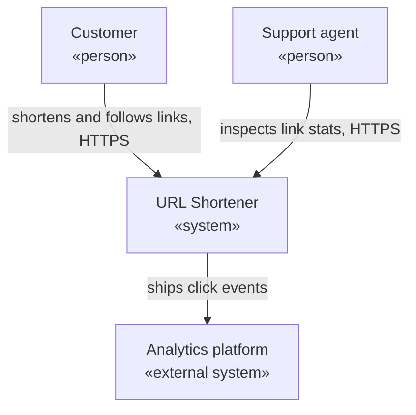
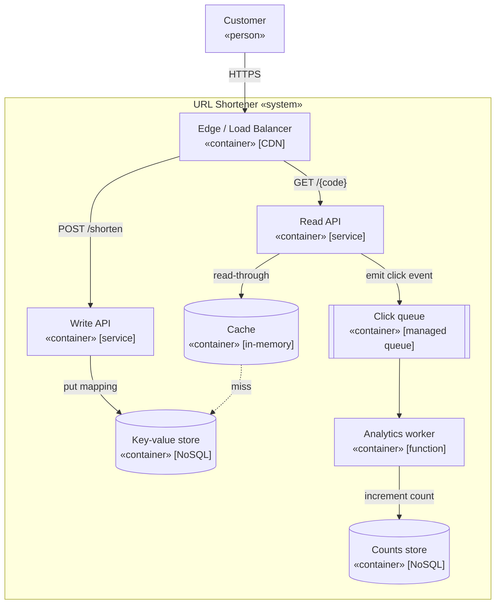
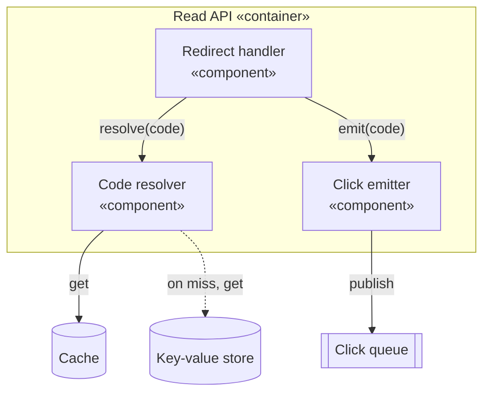
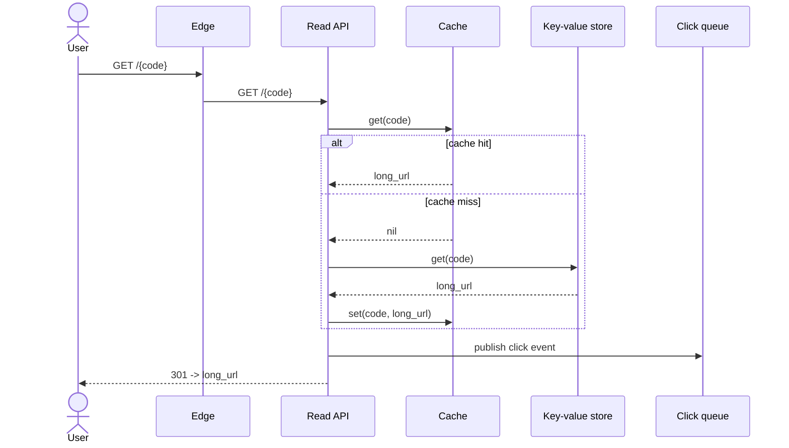
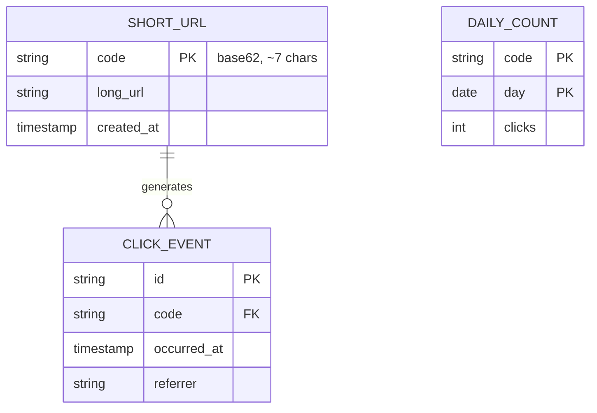

# Diagrams as a deliverable: C4 in Mermaid

A diagram is an output of the design, not a decoration on it. The deliverable is a set
of [C4](https://c4model.com/) views — System Context, then Container, then Component on
the one container worth zooming into — plus a sequence diagram for a load-bearing flow
and an ER diagram for a load-bearing schema. Writing them in **Mermaid** inside fenced
` ```mermaid ` blocks means the diagram lives in the Markdown, renders in GitHub and
Obsidian, and diffs in version control beside the code.

This reference gives the altitude rules, then a renderable Mermaid example per
diagram kind, and closes by emitting the full set for the
[URL shortener](design-process.md#worked-example-the-url-shortener).

## Why Mermaid, and the portability rule

Mermaid renders from text, so a diagram reviews in a pull request and never drifts from
a binary nobody can edit. One portability caveat decides the syntax: Mermaid ships an
experimental `C4Context` / `C4Container` dialect, but the renderer version bundled with
Obsidian and some GitHub contexts does not support it reliably. The robust choice is to
draw the C4 *levels* with the universally supported `flowchart` syntax and encode the
C4 meaning in the labels — `«system»`, `«container»`, `[tech]` — so the diagram renders
everywhere. The examples below take that route.

## The C4 levels

C4 keeps a diagram at one altitude so a reader knows what each box means. Three levels
carry most design work, and a box is a container only when something deploys or runs it
— a process, a database, or a managed service, never a library.

| Level | Shows | Audience | Reach for it |
|---|---|---|---|
| **1. System Context** | The system as one box, its users, and the external systems it talks to. | Anyone, technical or not. | Always — it sets the scope. |
| **2. Container** | The deployable and runnable units and the calls between them, each labeled with a protocol. | Engineers. | Always — most system-design work lives here. |
| **3. Component** | The major parts inside one container and their responsibilities. | The engineers building that container. | Only the container whose internals are contested. |

A fourth level (Code / class diagrams) exists; skip it — the code is the code at that
altitude.

## Level 1: System Context

The whole system as one box, surrounded by who uses it and what it depends on. The
question a reader answers from it: where does this system sit in the world?



The altitude check: one box for the system under design, every other box a person or an
external system, and no internal structure shown.

## Level 2: Container

The deployable units inside the system box and the calls between them, each call labeled
with its protocol. This is the workhorse diagram of system design.



The altitude check: every box deploys or runs as a unit, every arrow carries a
protocol or an operation, and no box is a library or a class.

## Level 3: Component

The inside of one container — the container whose internals are contested. Here, the
Read API, because its cache-miss fall-through and click-emit path are the design's hot
spot.



The altitude check: every box is a part *inside* one container, and the containers it
talks to appear only as edges leaving the boundary.

## Sequence diagram: a load-bearing flow

A sequence diagram traces one request across the boundaries it crosses over time — the
right tool for a flow whose ordering or failure behavior is the point. The redirect read
path, with the cache miss:



The `alt` block is where a sequence diagram earns its place: it shows the two paths
through one flow that prose tends to blur. The click publish sits after the redirect
returns, so a queue outage never blocks the user.

## ER diagram: a load-bearing schema

An ER diagram names entities, their keys, and the relationships between them — the right
tool when the data model is the contested part. The shortener's schema:



The ER diagram makes the access pattern legible: `SHORT_URL` keyed by `code` for the
point lookup, `CLICK_EVENT` as the append-only event stream, `DAILY_COUNT` as the
rolled-up read model the analytics worker maintains.

## Decision procedure

Emit the set in this order, stopping when the design is covered:

1. **Always draw Level 1 and Level 2.** The System Context sets scope; the Container
   diagram is the design. The step is done once both render and every container box
   names a responsibility.
2. **Draw Level 3 only on the contested container.** One Component diagram, on the
   container whose internals carry risk. The step is done once the contested container
   has a Component view, or once no container's internals are contested.
3. **Add a sequence diagram for a load-bearing flow.** Reach for one where ordering or
   failure behavior decides the design. The step is done once each flow with a
   non-obvious failure path has a sequence diagram.
4. **Add an ER diagram for a load-bearing schema.** Reach for one where the data model
   is contested. The step is done once the schema names every entity's key.

## Failure modes

- **Altitude mixing.** A class beside a service beside a cloud region in one diagram, so
  no reader knows what a box means. Counter: one C4 level per diagram, enforced by the
  label convention.
- **The big-ball-of-mud diagram.** Twenty boxes and forty crossing arrows on one canvas,
  unreadable and unmaintained. Counter: split by C4 level; a Container diagram past
  ~12 boxes wants a Component diagram instead.
- **Unlabeled edges.** Arrows with no protocol or operation, so the diagram shows
  topology but not contract. Counter: every edge carries a protocol, an operation, or a
  payload.
- **Stale diagram.** A picture that no longer matches the code because it lived in a
  binary nobody edits. Counter: the diagram is Mermaid text in the repo, reviewed in the
  same pull request as the change.
- **Diagram-as-decoration.** A pretty picture with no decision attached. Counter: every
  diagram set ships beside the [ADR](adr-and-docs.md) that records why the structure is
  shaped that way.

### Red flags

- A single diagram that mixes people, services, and classes.
- An arrow with no label.
- A Container diagram with more than ~12 boxes and no Component breakdown.
- A diagram stored as a PNG with no editable source in the repo.
- A sequence diagram with no `alt`/`opt` block on a flow that has a failure path.
- An ER diagram where an entity has no primary key marked.

## Worked example: the URL shortener

The full deliverable for the
[URL shortener](design-process.md#worked-example-the-url-shortener) is the set above,
emitted together: the **System Context** (Level 1) places it among its users and the
analytics platform; the **Container** diagram (Level 2) is the design, every box a
deployable unit with a protocol on every edge; the **Component** diagram (Level 3) zooms
into the Read API, the contested container; the **sequence** diagram traces the redirect
with its cache-miss branch; and the **ER** diagram fixes the schema around the
point-lookup access pattern. Paired with
[ADR-001](adr-and-docs.md#worked-adr), the set is the complete output of the design
exercise — navigable by a reader, and diffable in the repo.
